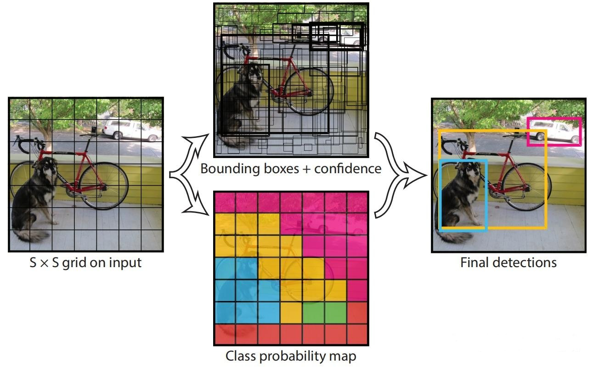
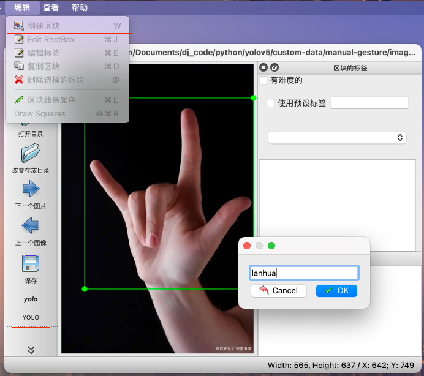
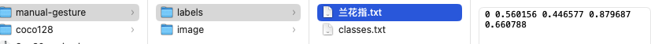
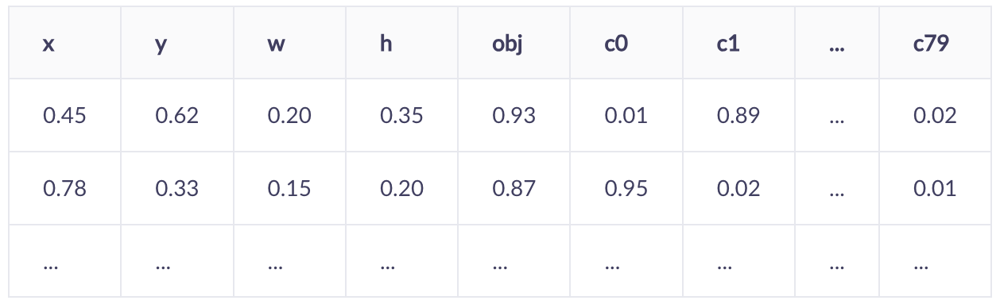

### yolo

#### 概念简介

YOLO（You Only Look Once）是一种基于深度学习的实时目标检测算法，由Joseph Redmon等人在2015年首次提出，通过单次前向传播直接预测图像中物体的位置和类别。具有速度快、准确率高、可解释性强和适用性广等优点，其可应用于检测、分割、姿态估计、跟踪和分类等视觉AI任务。其核心理念在于将目标检测任务转化为一个单一的回归问题，从输入图像直接预测目标的类别和边界框。

核心原理：

- 传统目标检测方法（如R-CNN系列）通常需要多个步骤：生成候选区域、特征提取、分类、边界框回归。
- YOLO将目标检测视为一个回归问题，使用单个神经网络直接从图像像素到边界框坐标和类别概率的映射。



YOLO将输入图像分成S×S的网格。如果一个目标的中心落入一个网格单元中，该网格单元负责检测该目标。每个网格单元预测这些盒子的B个边界框和置信度分数。这些置信度分数反映了该模型对盒子是否包含目标的置信度，以及它预测盒子的准确程度。

- **边界框（Bounding Boxes）**：每个网格预测B个边界框，每个边界框包含5个值：`(x, y, w, h, confidence)`。
  - `(x, y)`：边界框中心相对于网格左上角的坐标（归一化到0-1）。
  - `(w, h)`：边界框的宽度和高度相对于整个图像尺寸的归一化值。
  - `confidence`：置信度，表示边界框包含目标且预测准确的置信度，计算为`Pr(Object) * IOU_{truth}^{pred}`。如果网格中没有目标，则置信度为0。
- **类别概率（Class Probabilities）**：每个网格预测C个类别概率，即`Pr(Class_i | Object)`，表示网格中包含某个类别的条件概率。

**非极大值抑制（NMS）：**由于多个网格可能预测同一个目标，YOLO使用NMS来消除重叠的边界框，保留置信度最高的预测框。


#### 数据标注

使用labelImg标注软件

```
# 使用 pip 安装
pip3 install labelImg
# 直接运行
labelImg
```

如果有异常退出，确认python版本是否正确，要求3.9-3.10。

标注：选择标注格式yolo，框选区块，填写标签。



标注结果：



classes.txt中是标签信息、标注文件名.txt中是标签索引和x(中心点)、y(中心点)、w、h信息。

#### yolov5训练

```
python train.py --data ./data/coco128.yaml --weights yolov5s.pt --epochs 60 --img 640
```

如果是训练其他模型，则修改yaml文件，指定训练集、测试集位置，以及相应的分类类别。

coco128.yaml

```
# Train/val/test sets as 1) dir: path/to/imgs, 2) file: path/to/imgs.txt, or 3) list: [path/to/imgs1, path/to/imgs2, ..]
path: ../datasets/coco128 # dataset root dir
train: images/train2017 # train images (relative to 'path') 128 images
val: images/train2017 # val images (relative to 'path') 128 images
test: # test images (optional)

# Classes
names:
  0: person
  1: bicycle
  2: car
  3: motorcycle
  4: airplane
```

照着coco128.yaml文件修改数据跟目录，训练、验证、测试数据集文件目录。在names下修改训练的各分类名称。

### tflite集成

#### 模型导出

将YOLO模型转换为TFLite格式时，通常会进行优化（如量化、剪枝）以在移动设备上实现实时推理。输出维度可能因模型版本和配置而异，但基本结构相似。

在 Ultralytics YOLO 框架中，可以通过 `export.py` 脚本或者在使用模型时调用 `export` 方法来导出 TFLite 模型。

执行python脚本

```
from ultralytics import YOLO
 
# 加载模型
model = YOLO("yolo11n.pt")
 
# 导出为 TFLite
model.export(format="tflite", imgsz=320)  # 创建 'yolo11n_float32.tflite'
```

或直接执行导出命令

```
python export.py --weights yolov5s.pt --include tflite --img 320
```

--weights，指定预训练模型

--img 指定模型输入图片大小

#### v5与11格式解析区别

YOLOv5使用预定义的锚框（anchors），而YOLOv8之后采用了无锚（anchor-free）的方式。输出内容包括：边界框坐标、置信度、类别概率，但排列顺序有所不同不同。

YOLOv5通常有三个检测头（对于不同尺度）。

- YOLOv5: [batch_size, num_predictions, 5 + num_classes]（重塑后）
- YOLOv8: [batch_size, 4 + num_classes, num_predictions]

**举例来说：**

**yolov5目标检测模型输出：[1, 6300, 85]**

第二个维度6300: anchor box数量

第三个维度85:表示每个anchor的输出内容。yolov5的每个预测包含以下信息：
.4个值：边界框坐标（x,y,w,h),表示预测框的位置和大小。
.1个值：对象置信度（objectnessscore),表示该位置是否存在目标。
.80个值：类别置信度（classprobablities),表示属于每个类别的概率（假设有80个类
别）。

yolov5 目标检测输出：



检测输出信息按行进行读取。

**yolo11 目标检测模型输出形状：[1, 84, 2100]**

- 批大小：1
- 每个框的信息维度：84（4个坐标 + 80个类别分数），没有目标置信度，只有类别置信度。
- 预测框总数：2100

yolov11 目标检测输出：总共2100列。


检测输出信息按列进行读取。

#### 解析步骤

主要步骤包括：

1. 模型加载与初始化
2. 图像预处理
3. 模型推理
4. 输出后处理（解码、NMS等）
5. 结果绘制

### NCNN集成

1、模型转换

参考如下

https://github.com/nihui/ncnn-android-yolo11

目标检测

1、安装相关python依赖

```
pip3 install -U ultralytics pnnx ncnn
```

2、export yolo11 torchscript

```
yolo export model=yolo11n.pt format=torchscript //目标识别
yolo export model=yolo11n-seg.pt format=torchscript //实例分割
```

3、convert torchscript with static shape

对于分类模型 ，这3步已足够

```
pnnx yolo11n.torchscript
pnnx yolo11n-seg.torchscript
```

4、手动修改pnnx模型脚本以进行动态形状推理

对于目标检测，编辑 `yolo11n_pnnx.py` 文件。参考文档中是v_235 = v_204.view(1, 144, 6400)，而实际转换得到的是v_235 = v_204.reshape(1, 144, 6400)，根据实际的输出进行对应调整。

| 改变前                                                       | 改变后                                                       |
| ------------------------------------------------------------ | ------------------------------------------------------------ |
| v_235 = v_204.reshape(1, 144, 6400)<br/>v_236 = v_219.reshape(1, 144, 1600)<br/>v_237 = v_234.reshape(1, 144, 400)<br/>v_238 = torch.cat((v_235, v_236, v_237), dim=2)<br/># ... | v_235 = v_204.reshape(1, 144, -1).transpose(1, 2)<br/>        v_236 = v_219.reshape(1, 144, -1).transpose(1, 2)<br/>        v_237 = v_234.reshape(1, 144, -1).transpose(1, 2)<br/>        v_238 = torch.cat((v_235, v_236, v_237), dim=1)<br/>        return v_238 |

调整区域注意力以进行动态形状推理

| 改变前                                                       | 改变后                                                       |
| ------------------------------------------------------------ | ------------------------------------------------------------ |
| v_95 = self.model_10_m_0_attn_qkv_conv(v_94)<br/>        v_96 = v_95.reshape(1, 2, 128, -1)<br/>        v_97, v_98, v_99 = torch.split(tensor=v_96, dim=2, split_size_or_sections=(32,32,64))<br/>        v_100 = torch.transpose(v_97, dim0=-2, dim1=-1)<br/>        v_101 = torch.matmul(v_100, other=v_98)<br/>        v_102 = (v_101 * 0.176777)<br/>        v_103 = F.softmax(v_102, dim=-1)<br/>        v_104 = torch.transpose(v_103, dim0=-2, dim1=-1)<br/>        v_105 = torch.matmul(v_99, other=v_104)<br/>         v_106 = v_105.reshape(1, 128, 20, 20)<br/>         v_107 = v_99.reshape(1, 128, 20, 20)<br/>        v_108 = self.model_10_m_0_attn_pe_conv(v_107)<br/>        v_109 = (v_106 + v_108)<br/>        v_110 = self.model_10_m_0_attn_proj_conv(v_109) | v_95 = self.model_10_m_0_attn_qkv_conv(v_94)<br/>        v_96 = v_95.reshape(1, 2, 128, -1)<br/>        v_97, v_98, v_99 = torch.split(tensor=v_96, dim=2, split_size_or_sections=(32,32,64))<br/>        v_100 = torch.transpose(v_97, dim0=-2, dim1=-1)<br/>        v_101 = torch.matmul(v_100, other=v_98)<br/>        v_102 = (v_101 * 0.176777)<br/>        v_103 = F.softmax(v_102, dim=-1)<br/>        v_104 = torch.transpose(v_103, dim0=-2, dim1=-1)<br/>        v_105 = torch.matmul(v_99, other=v_104)<br/>        v_106 = v_105.reshape(1, 128, v_95.size(2), v_95.size(3)) # <--- This line<br/>        v_107 = v_99.reshape(1, 128, v_95.size(2), v_95.size(3)) # <--- This line<br/>        v_108 = self.model_10_m_0_attn_pe_conv(v_107)<br/>        v_109 = (v_106 + v_108)<br/>        v_110 = self.model_10_m_0_attn_proj_conv(v_109) |

5、重新导出yolo11的torchscript文件

```
python3 -c 'import yolo11n_pnnx; yolo11n_pnnx.export_torchscript()'
```

6、将新的torchscript转换为动态形状

```
pnnx yolo11n_pnnx.py.pt inputshape=[1,3,640,640] inputshape2=[1,3,320,320]
```

7、得到ncnn模型文件

```
yolo11n_pnnx.py.ncnn.param  yolo11n_pnnx.py.ncnn.bin
```

修改文件名，拷贝模型文件。


​	不同机器对gpu加速的支持差异较大，使用了nihui的demo，在2个手机上测试，使用gpu推理，帧率降到了使用cpu推理的三分之一左右，但是在rk开发板上，cpu与gpu推理帧率相当。ncnn使用cpu比tflite使用gpu推理快，但是cpu负载250对100，负载大。

​    ncnn使用gpu推理很慢，tflite使用cpu推理很慢。具体性能表现还是得结合设备实际效果进行观察。


### 参考

https://github.com/455670288/ncnn-android-yolov5s-hand-master

https://www.zhihu.com/collection/740412872

https://github.com/nihui/ncnn-android-yolo11

https://zhuanlan.zhihu.com/p/708973281

